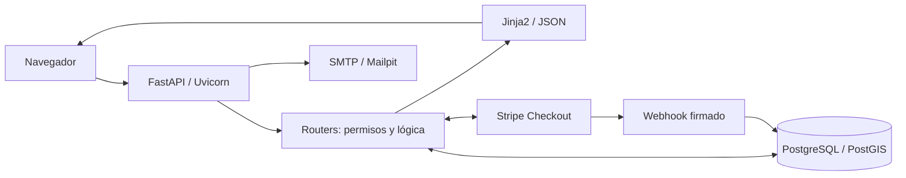

# 🌍 Distans-FastAPI


Aplicación web para conectar comercios y compradores mediante FastAPI, SQLAlchemy y PostgreSQL con PostGIS. Docker Compose proporciona la aplicación, la base de datos, las migraciones y el correo local en un entorno reproducible.

Desarrollo backend/frontend del Trabajo de Fin de Grado «Diseño y desarrollo de un marketplace geolocalizado para el fomento del comercio de proximidad», orientado al descubrimiento de comercios cercanos y a la compra online en tiendas con Premium activo. FastAPI sirve una API HTTP y genera las páginas HTML mediante Jinja2.

## 📑 Índice

- [1. Características Principales y Roles](#1-características-principales-y-roles)
- [2. Arquitectura y Tecnologías](#2-arquitectura-y-tecnologías)
- [3. Requisitos Previos](#3-requisitos-previos)
- [4. Guía de Instalación y Despliegue Local](#4-guía-de-instalación-y-despliegue-local)
- [5. Carga de Datos de Demostración (Seed)](#5-carga-de-datos-de-demostración-seed)
- [6. Lógica de Negocio: Pedidos, Pagos y Stock](#6-lógica-de-negocio-pedidos-pagos-y-stock)
- [7. Integración con Stripe](#7-integración-con-stripe)
- [8. Ejecución de Pruebas y Benchmarking](#8-ejecución-de-pruebas-y-benchmarking)
- [9. Comandos de Administración Útiles](#9-comandos-de-administración-útiles)
- [10. Resolución de Problemas (FAQ)](#10-resolución-de-problemas-faq)
- [11. Detener el Proyecto y Limpiar Datos](#11-detener-el-proyecto-y-limpiar-datos)

## 1. Características Principales y Roles

| Acceso | Funcionalidades |
| --- | --- |
| Comprador | Catálogo, tiendas, mapa, filtros, favoritos, valoraciones, comentarios, carrito, compra y consulta de pedidos. |
| Invitado | Catálogo, mapa, carrito y compra sin crear una cuenta. Favoritos, valoraciones y comentarios requieren una cuenta. |
| Vendedor | Panel de su tienda, edición de información, productos, ofertas y stock, estadísticas, plan y pedidos de su tienda. |
| Administrador | Gestión global de usuarios, tiendas, productos, comentarios y pedidos. |

La identificación utiliza email y contraseña. El registro público permite elegir comprador o vendedor; el rol administrador no está disponible. El rol y la propiedad se comprueban en el servidor en cada operación privada.

### Catálogo y búsqueda geográfica

- Productos de ocho categorías, con imagen, marca, precio, oferta, disponibilidad, destacado y stock.
- Filtros por texto, categoría, precio, modalidad de compra, valoración, ubicación y radio.
- Listado de productos y tiendas, y mapa con Leaflet.
- Ubicación introducida por el usuario o solicitada al navegador.
- Distancias y filtros respaldados por PostgreSQL/PostGIS y GeoAlchemy2.
- Valoraciones de una a cinco estrellas y un comentario por comprador y entidad.
- Estadísticas de visitas. Una ficha registra como máximo una visita por visitante cada sesenta minutos.

### Direcciones principales

Las rutas se sirven desde `http://localhost:8001` en el entorno Docker local.

| Ruta | Uso |
| --- | --- |
| `/`, `/login`, `/registro` | Acceso, identificación y registro. |
| `/recuperar-contrasena`, `/restablecer-contrasena` | Recuperación de contraseña. |
| `/inicio` | Catálogo de productos, tiendas y mapa. |
| `/productos/<id>`, `/tiendas/<id>` | Fichas públicas. |
| `/carrito`, `/compra/carrito`, `/compra/<id>` | Carrito y compra. |
| `/favoritos`, `/usuarios/cuenta` | Favoritos y perfil. |
| `/pedidos/historial`, `/pedidos/seguimiento` | Historial y seguimiento. |
| `/mi-tienda` | Entrada al panel del vendedor. |
| `/gestion/tiendas/<id>` | Panel de una tienda. |
| `/gestion/tiendas/<id>/productos` | Gestión de productos. |
| `/gestion/tiendas/<id>/pedidos` | Pedidos de la tienda. |
| `/gestion/plan` | Contratación de Premium. |
| `/administracion`, `/admin/tiendas`, `/admin/pedidos/panel` | Gestión administrativa. |
| `/api/stripe/webhook` | Eventos firmados de Stripe. |
| `/docs`, `/redoc` | Documentación OpenAPI. |

## 2. Arquitectura y Tecnologías

El entorno utiliza Python 3.11, FastAPI 0.115, Uvicorn, SQLAlchemy 2, Pydantic 2, PostgreSQL 15 y PostGIS 3.4. Jinja2 renderiza la interfaz y el JavaScript consume los endpoints JSON necesarios.

```text
app/                    Modelos, esquemas, seguridad, pagos y lógica compartida.
app/routers/            Rutas HTML y API por dominio.
templates/              Plantillas Jinja2.
static/                 CSS, JavaScript, imágenes, subidas y Leaflet local.
scripts/                Migraciones, seed y preparación de carga.
migrations/             SQL histórico y documentación del esquema.
tests/                  Pruebas automatizadas con Pytest.
load_tests/             Escenarios de Locust.
main.py                 Aplicación, middleware, routers y ciclo ASGI.
docker-compose.yml      Aplicación, base de datos, migración y correo.
```



Relaciones principales: vendedor → tienda → productos; comprador → carrito → líneas; pedido → líneas y subpedidos por tienda. Un pedido puede ser de un usuario o de un invitado. Los subpedidos permiten que cada vendedor gestione únicamente su parte.

La aplicación incorpora PBKDF2-SHA256, sesiones firmadas, cookies `SameSite=Lax`, protección CSRF, validación Pydantic, controles de rol y propiedad, cabeceras defensivas, hosts de confianza y verificación de webhooks.

### Alcance actual

Compose ejecuta Uvicorn con `--reload`; es un entorno de desarrollo y evaluación, no de producción. Un despliegue público requiere HTTPS, secretos externos, proxy inverso, limitación de peticiones, copias, observabilidad y almacenamiento persistente de imágenes.

El esquema se prepara con un migrador incremental propio. Para una evolución prolongada sería recomendable usar Alembic. Premium es un cobro único por un mes, no una suscripción renovable automáticamente.

## 3. Requisitos Previos

- Git.
- Docker Desktop o Docker Engine con Docker Compose.

No es necesario instalar Python, FastAPI, GDAL ni PostgreSQL localmente. Python solo se necesita en el equipo para ejecutar Locust en un entorno virtual separado.

## 4. Guía de Instalación y Despliegue Local

### 1. Clonar el repositorio

```bash
git clone https://github.com/STX3837/Distans-FastAPI.git
cd Distans-FastAPI
```

### 2. Crear el archivo `.env`

PowerShell:

```powershell
Copy-Item .env.example .env
```

Linux o macOS:

```bash
cp .env.example .env
```

Configuración mínima de desarrollo:

```env
DB_NAME=distans_db
DB_USER=distans_user
DB_PASSWORD=una_contrasena_segura
DB_HOST=db
DB_PORT=5432

ENVIRONMENT=development
SESSION_SECRET_KEY=replace-with-a-long-random-secret
ALLOWED_HOSTS=localhost,127.0.0.1
PUBLIC_BASE_URL=http://localhost:8001

SMTP_HOST=mailpit
SMTP_PORT=1025
SMTP_STARTTLS=false
SMTP_FROM=no-reply@distans.test
SMTP_USER=
SMTP_PASSWORD=

STRIPE_SECRET_KEY=
STRIPE_WEBHOOK_SECRET=
CHECKOUT_IVA=0.21
CHECKOUT_ENVIO=0
```

`.env` contiene secretos y no debe subirse. Sin Stripe siguen disponibles el catálogo, la gestión y el contrarrembolso; no funcionan el pago inmediato ni la contratación de Premium.

### 3. Construir y arrancar los servicios

```bash
docker compose up -d --build
```

- `web`: FastAPI/Uvicorn en `http://localhost:8001`.
- `db`: PostgreSQL/PostGIS en `localhost:5434`; entre contenedores se usa `db:5432`.
- `migrate`: prepara el esquema antes de iniciar `web`.
- `mailpit`: SMTP local y bandeja en `http://localhost:8025`.

El volumen `fastapi_postgres_data` conserva la base de datos. El proyecto se monta en `web`, incluido `static/uploads/`.

### 4. Aplicar migraciones

Compose las ejecuta automáticamente. Para repetirlas:

```bash
docker compose run --rm migrate
```

Sin Compose:

```bash
python -m scripts.migrate
uvicorn main:app --reload --port 8001
```

### 5. Crear un usuario administrador

No existe un comando interactivo equivalente a `createsuperuser`. El seed crea de forma reproducible `admin@demo.example.com` junto con el resto de la demo.

### Configuración del entorno

| Variable | Función |
| --- | --- |
| `DB_NAME`, `DB_USER`, `DB_PASSWORD` | Base de datos y credenciales. |
| `DB_HOST`, `DB_PORT` | Host y puerto; Compose usa `db:5432`. |
| `SESSION_SECRET_KEY` | Firma de sesiones; obligatoria. |
| `ENVIRONMENT` | `development`, `staging` o `production`. |
| `ALLOWED_HOSTS` | Hosts admitidos, separados por comas. |
| `PUBLIC_BASE_URL` | Enlaces de correo y retornos de Stripe. |
| `SMTP_*` | Servidor, remitente y credenciales de correo. |
| `STRIPE_SECRET_KEY` | Clave privada de Stripe. |
| `STRIPE_WEBHOOK_SECRET` | Validación de la firma del webhook. |
| `CHECKOUT_IVA`, `CHECKOUT_ENVIO` | IVA y coste fijo de entrega. |
| `DEMO_PASSWORD` | Contraseña opcional del seed; mínimo 12 caracteres. |

Tras cambiar `.env`:

```bash
docker compose up -d --force-recreate web migrate
```

## 5. Carga de Datos de Demostración (Seed)

```bash
docker compose exec web python -m scripts.seed_catalogo
```

Es repetible y restablece solo la fixture demo: 11 usuarios, 8 tiendas, 24 productos, 5 pedidos, un carrito, favoritos y visitas. Mantiene un escenario comparable con Distans-Django.

### Usuarios

La contraseña predeterminada es **`DemoDistans2026!`**; puede cambiarse con `DEMO_PASSWORD`.

| Acceso | Email |
| --- | --- |
| Administrador | `admin@demo.example.com` |
| Comprador | `comprador@demo.example.com` |
| Segundo comprador | `comprador2@demo.example.com` |
| Vendedor: librería | `libreria@demo.example.com` |
| Vendedor: tecnología | `tecnologia@demo.example.com` |
| Vendedor: jardín | `jardin@demo.example.com` |
| Vendedor: mercado | `mercado@demo.example.com` |
| Vendedor: hogar | `hogar@demo.example.com` |
| Vendedor: Triana | `sevilla-triana@demo.example.com` |
| Vendedor: Sevilla Centro | `sevilla-centro@demo.example.com` |
| Vendedor: Nervión | `sevilla-nervion@demo.example.com` |

### Tiendas

| Tienda | Ciudad | Coordenadas | Plan |
| --- | --- | --- | --- |
| Librería Horizonte Demo | Madrid | 40.416800, -3.703800 | Premium |
| Tecnología Centro Demo | Madrid | 40.420000, -3.700000 | Premium |
| Jardín del Barrio Demo | Madrid | 40.430000, -3.710000 | Freemium |
| Mercado Artesano Demo | Madrid | 40.460000, -3.690000 | Premium |
| Hogar Alcalá Demo | Alcalá de Henares | 40.481000, -3.364000 | Freemium |
| Artesanía Triana Demo | Sevilla | 37.383000, -6.003000 | Premium |
| Librería Sevilla Centro Demo | Sevilla | 37.389100, -5.984500 | Premium |
| Flores Nervión Demo | Sevilla | 37.382500, -5.970000 | Freemium |

Premium permite compra online. Freemium aparece como escaparate sin compra online.

### Productos

Los 24 productos conservan los nombres, categorías, precios, ofertas y stock final de la fixture comparable. Incluyen casos destacados, agotados y no disponibles.

| Tienda | Ejemplos | Categorías |
| --- | --- | --- |
| Librería Horizonte | Novela, juego, cuaderno | Cultura y papelería |
| Tecnología Centro | Auriculares, teclado, ratón agotado | Tecnología |
| Jardín del Barrio | Planta, ramo, maceta | Floristería y hogar |
| Mercado Artesano | Cesta, bolsa, jabón | Alimentación, moda y salud |
| Hogar Alcalá | Lámpara, herramientas, organizador | Hogar y papelería |
| Artesanía Triana | Azulejo, abanico, taza | Hogar y moda |
| Librería Sevilla Centro | Guía, cuaderno, cartas | Cultura y papelería |
| Flores Nervión | Ramo, planta, jardinera | Floristería y hogar |

### Imágenes predeterminadas

El seed deja vacíos los campos de imagen para usar los recursos predeterminados. Las imágenes subidas se guardan en `static/uploads/`, que no se versiona.

### Pedidos, carrito, favoritos y visitas

| Código | Comprador | Producto | Pago | Estado |
| --- | --- | --- | --- | --- |
| `PED-DEMO-001` | Primero | Novela de aventuras | Contrarrembolso | En preparación |
| `PED-DEMO-002` | Segundo | Novela de aventuras | Contrarrembolso | Enviado |
| `PED-DEMO-003` | Primero | Novela de aventuras | Contrarrembolso | Entregado |
| `PED-DEMO-004` | Segundo | Auriculares inalámbricos | Tarjeta pagada | En preparación |
| `PED-DEMO-005` | Primero | Auriculares inalámbricos | Tarjeta cancelada | Cancelado |

También crea un carrito, un producto favorito, una tienda favorita, 72 visitas de producto y 56 de tienda.

## 6. Lógica de Negocio: Pedidos, Pagos y Stock

El carrito funciona para compradores e invitados. Al confirmar, el servidor vuelve a comprobar productos, precios, ofertas, disponibilidad, plan y stock; también recalcula todos los importes.

Se puede comprar el carrito o un producto directamente. Una compra con varias tiendas genera un subpedido por tienda. El stock se descuenta atómicamente al crear el pedido para evitar sobreventa concurrente.

### Estado del pedido y estado del pago

- El pedido tiene estado global y cada tienda gestiona su subpedido.
- Stripe Checkout procesa el pago inmediato; los datos bancarios no atraviesan la aplicación.
- El contrarrembolso no se marca como pagado.
- El administrador ve el pedido completo; el vendedor, solo su tienda.
- Cancelaciones y expiraciones reponen stock una sola vez.
- Si baja el importe de un pedido pagado, se registra el reembolso pendiente para su gestión externa.

### Reservas y conservación del historial

El pago con tarjeta reserva stock durante **31 minutos**. Una tarea asíncrona de Uvicorn revisa cada minuto las reservas vencidas, consulta Stripe y libera el stock. Si Stripe no responde, conserva la reserva para evitar cancelar un pago posiblemente completado.

Las líneas guardan cantidad y precio. El carrito retira solo las unidades compradas y conserva las añadidas durante el checkout. Los códigos, usuarios y sesiones se validan en el servidor.

### Planes de las tiendas

| Plan | Comportamiento |
| --- | --- |
| Freemium | Catálogo y mapa; productos sin compra online. |
| Premium | Compra online mientras el plan, la pasarela y la vigencia estén activos. |

Premium cuesta **14,99 €** mediante un pago único que añade un mes natural. Si todavía queda vigencia, el mes nuevo se suma al final del periodo existente. No hay renovación automática.

## 7. Integración con Stripe

### Recibir eventos en local

Instala y autentica la [CLI oficial de Stripe](https://docs.stripe.com/stripe-cli):

```bash
stripe login
stripe listen --forward-to http://localhost:8001/api/stripe/webhook
```

Copia el `whsec_...` a `STRIPE_WEBHOOK_SECRET`, define `STRIPE_SECRET_KEY` y recrea `web`:

```bash
docker compose up -d --force-recreate web
```

El listener debe seguir abierto. La aplicación valida firma, sesión, referencia, moneda e importe. El webhook procesa compras y pagos Premium.

### Tarjeta de prueba

| Campo | Valor |
| --- | --- |
| Número | `4242 4242 4242 4242` |
| Caducidad | Una fecha futura, por ejemplo `12/34` |
| CVC | Tres dígitos, por ejemplo `123` |
| Código postal | Cualquiera válido |

Usa siempre modo test y nunca tarjetas reales. Más casos en la [documentación de Stripe](https://docs.stripe.com/testing#cards).

## 8. Ejecución de Pruebas y Benchmarking

Pytest utiliza SQLite en memoria, aislado de desarrollo:

```bash
docker compose exec -e PYTHONPATH=/app web python -m pytest -q
```

La suite cubre autenticación, roles, catálogo, filtros, carrito, compra, stock, pagos, Premium, favoritos, valoraciones, comentarios, administración, estados y seed.

### Pruebas de carga

Locust ofrece `baseline`, `stress` y `write`. No deben ejecutarse contra producción: crean sesiones, visitas y carritos; `write` también modifica datos controlados.

#### 1. Preparar la aplicación y los datos

```powershell
docker compose -f docker-compose.yml -f docker-compose.load.yml up -d --build
docker compose exec web python -m scripts.seed_catalogo
```

El segundo archivo de Compose ejecuta Uvicorn con tres workers y sin recarga
automática exclusivamente para las pruebas de carga. El arranque habitual con
`docker compose up` conserva el modo de desarrollo con `--reload`.

#### 2. Instalar Locust

```powershell
python -m venv .load-venv
.\.load-venv\Scripts\python.exe -m pip install -r requirements-load.txt
```

#### 3. Ejecutar la prueba de referencia

Cuatro minutos: 10, 25 y 10 usuarios.

```powershell
$env:LOAD_STAGES="baseline"
.\.load-venv\Scripts\locust.exe -f load_tests\locustfile.py --headless `
  --host http://localhost:8001 `
  --csv load_results\baseline `
  --html load_results\baseline.html
```

#### 4. Ejecutar una prueba de estrés

Seis minutos: 25, 75, 150 y 25 usuarios.

```powershell
$env:LOAD_STAGES="stress"
.\.load-venv\Scripts\locust.exe -f load_tests\locustfile.py --headless `
  --host http://localhost:8001 `
  --csv load_results\stress `
  --html load_results\stress.html
```

#### 5. Ejecutar la prueba de escritura

Tres minutos: 2, 5 y 2 usuarios. Prepara antes sus pedidos aislados:

```powershell
docker compose exec web python -m scripts.prepare_load_test
$env:LOAD_STAGES="write"
.\.load-venv\Scripts\locust.exe -f load_tests\locustfile.py --headless `
  --host http://localhost:8001 `
  --csv load_results\write `
  --html load_results\write.html
```

Cada usuario crea y edita un producto `LOADTEST-*`, avanza un pedido `LOAD-WRITE-*` y elimina el producto. El preparador es idempotente y limpia restos.

#### Ver la prueba en el navegador

```powershell
$env:LOAD_STAGES="baseline"
.\.load-venv\Scripts\locust.exe -f load_tests\locustfile.py `
  --host http://localhost:8001 `
  --web-host 127.0.0.1 `
  --web-port 8089
```

Abre `http://localhost:8089` y pulsa **Start swarming**.

#### Umbrales y lectura de resultados

Locust devuelve código 1 si los fallos superan el 1 %, el p95 supera 1200 ms o no hay peticiones. Para cambiarlo:

```powershell
$env:LOAD_MAX_FAILURE_RATIO="0.005"
$env:LOAD_MAX_P95_MS="800"
```

`baseline` y `stress` mezclan 70 % de visitantes, 20 % de compradores y 10 % de vendedores. Se pueden cambiar las credenciales con `LOAD_BUYER_EMAIL`, `LOAD_SELLER_EMAIL` y `LOAD_PASSWORD`.

Para comparar Django y FastAPI deben mantenerse hardware, datos, etapas y generador. Se recomiendan cinco repeticiones alternando el orden y comparar la mediana, p50, p95, p99, errores, peticiones por segundo y recursos.

## 9. Comandos de Administración Útiles

```bash
# Servicios y logs
docker compose ps
docker compose logs -f web
docker compose logs -f db

# Migraciones y datos demo
docker compose run --rm migrate
docker compose exec web python -m scripts.seed_catalogo
docker compose exec web python -m scripts.prepare_load_test

# Intérprete y pruebas
docker compose exec web python
docker compose exec -e PYTHONPATH=/app web python -m pytest -q
```

Para reconstruir tras cambios de dependencias:

```bash
docker compose up -d --build
```

OpenAPI está en `http://localhost:8001/docs`; el esquema JSON, en `http://localhost:8001/openapi.json`.

### Restablecer la contraseña mediante Mailpit

Pulsa **He olvidado mi contraseña**, introduce una cuenta activa y abre `http://localhost:8025`. Mailpit captura el correo localmente; su enlace permite definir la nueva contraseña.

En producción deben configurarse SMTP real, `ENVIRONMENT=production`, HTTPS y credenciales seguras. Mailpit es solo para desarrollo.

## 10. Resolución de Problemas (FAQ)

| Problema | Comprobación o solución |
| --- | --- |
| Docker no conecta | Iniciar Docker Desktop y ejecutar `docker compose ps`. |
| Falta `SESSION_SECRET_KEY` | Crear `.env` desde `.env.example` y definir una clave larga. |
| FastAPI no conecta con PostgreSQL | Revisar logs de `db`, variables `DB_*` y healthcheck. |
| Falta una tabla o columna | Ejecutar `docker compose run --rm migrate`. |
| Puerto 8001, 5434 u 8025 ocupado | Detener el proceso o cambiar el puerto publicado. |
| Catálogo vacío | Ejecutar el seed y revisar los filtros. |
| Tienda ausente del mapa | Revisar coordenadas, radio y geolocalización. |
| No aparecen imágenes | Revisar `static/uploads/`, formato y límite de 5 MB. |
| No se puede comprar | Comprobar disponibilidad, stock y Premium activo. |
| Stripe devuelve 503 | Configurar claves y `PUBLIC_BASE_URL`. |
| Falla el webhook | Usar el `whsec_...` actual y recrear `web`. |
| Reserva no liberada | El worker tarda hasta un minuto y espera si Stripe no responde. |
| No llega el correo | Revisar logs de Mailpit, `SMTP_*` y el puerto 8025. |
| Locust no inicia sesión | Repetir el seed o revisar `LOAD_*` y `DEMO_PASSWORD`. |

Leaflet se sirve localmente, pero el fondo cartográfico y Stripe dependen de servicios externos.

## 11. Detener el Proyecto y Limpiar Datos

Conservar la base de datos:

```bash
docker compose down
```

Eliminar también el volumen de PostgreSQL:

```bash
docker compose down -v
```

`down -v` elimina de forma irreversible `fastapi_postgres_data`. Las imágenes de `static/uploads/` permanecen en el directorio del proyecto.
